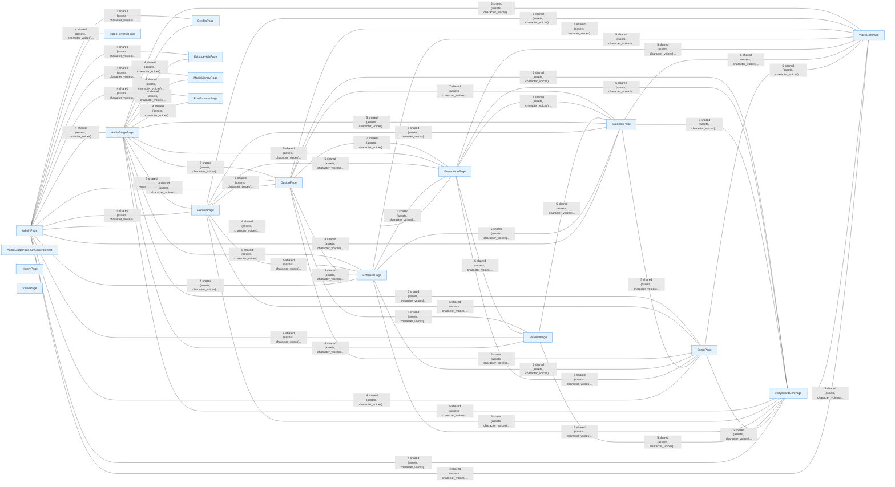

# Cross-Page Data Flow

Pairs of pages that share data through tables or Contexts. The label shows how many shared channels exist between two pages.

```mermaid
graph LR
  classDef pg fill:#e3f2fd,stroke:#1976d2;

  p_AdminPage["AdminPage"]:::pg
  p_AudioStagePage["AudioStagePage"]:::pg
  p_AudioStagePage_runGenerate_test["AudioStagePage.runGenerate.test"]:::pg
  p_CanvasPage["CanvasPage"]:::pg
  p_CreditsPage["CreditsPage"]:::pg
  p_DesignPage["DesignPage"]:::pg
  p_EnhancePage["EnhancePage"]:::pg
  p_EpisodeHubPage["EpisodeHubPage"]:::pg
  p_GenerationPage["GenerationPage"]:::pg
  p_HistoryPage["HistoryPage"]:::pg
  p_MaterialPage["MaterialPage"]:::pg
  p_MaterialsPage["MaterialsPage"]:::pg
  p_MediaLibraryPage["MediaLibraryPage"]:::pg
  p_PostProcessPage["PostProcessPage"]:::pg
  p_ScriptPage["ScriptPage"]:::pg
  p_StoryboardGenPage["StoryboardGenPage"]:::pg
  p_VideoGenPage["VideoGenPage"]:::pg
  p_VideoPage["VideoPage"]:::pg
  p_VideoReversePage["VideoReversePage"]:::pg

  p_DesignPage ---|"7 shared\n(assets, character_voices)..."| p_GenerationPage
  p_DesignPage ---|"7 shared\n(assets, character_voices)..."| p_MaterialsPage
  p_GenerationPage ---|"7 shared\n(assets, character_voices)..."| p_MaterialsPage
  p_DesignPage ---|"6 shared\n(assets, character_voices)..."| p_MaterialPage
  p_DesignPage ---|"6 shared\n(assets, character_voices)..."| p_StoryboardGenPage
  p_GenerationPage ---|"6 shared\n(assets, character_voices)..."| p_MaterialPage
  p_GenerationPage ---|"6 shared\n(assets, character_voices)..."| p_StoryboardGenPage
  p_MaterialPage ---|"6 shared\n(assets, character_voices)..."| p_MaterialsPage
  p_MaterialsPage ---|"6 shared\n(assets, character_voices)..."| p_StoryboardGenPage
  p_AudioStagePage ---|"5 shared\n(assets, character_voices)..."| p_CanvasPage
  p_AudioStagePage ---|"5 shared\n(assets, character_voices)..."| p_DesignPage
  p_AudioStagePage ---|"5 shared\n(assets, character_voices)..."| p_EnhancePage
  p_AudioStagePage ---|"5 shared\n(assets, character_voices)..."| p_GenerationPage
  p_AudioStagePage ---|"5 shared\n(assets, character_voices)..."| p_MaterialsPage
  p_AudioStagePage ---|"5 shared\n(assets, character_voices)..."| p_ScriptPage
  p_AudioStagePage ---|"5 shared\n(assets, character_voices)..."| p_StoryboardGenPage
  p_AudioStagePage ---|"5 shared\n(assets, character_voices)..."| p_VideoGenPage
  p_CanvasPage ---|"5 shared\n(assets, character_voices)..."| p_DesignPage
  p_CanvasPage ---|"5 shared\n(assets, character_voices)..."| p_EnhancePage
  p_CanvasPage ---|"5 shared\n(assets, character_voices)..."| p_GenerationPage
  p_CanvasPage ---|"5 shared\n(assets, character_voices)..."| p_MaterialsPage
  p_CanvasPage ---|"5 shared\n(assets, character_voices)..."| p_ScriptPage
  p_CanvasPage ---|"5 shared\n(assets, character_voices)..."| p_StoryboardGenPage
  p_CanvasPage ---|"5 shared\n(assets, character_voices)..."| p_VideoGenPage
  p_DesignPage ---|"5 shared\n(assets, character_voices)..."| p_EnhancePage
  p_DesignPage ---|"5 shared\n(assets, character_voices)..."| p_ScriptPage
  p_DesignPage ---|"5 shared\n(assets, character_voices)..."| p_VideoGenPage
  p_EnhancePage ---|"5 shared\n(assets, character_voices)..."| p_GenerationPage
  p_EnhancePage ---|"5 shared\n(assets, character_voices)..."| p_MaterialsPage
  p_EnhancePage ---|"5 shared\n(assets, character_voices)..."| p_ScriptPage
  p_EnhancePage ---|"5 shared\n(assets, character_voices)..."| p_StoryboardGenPage
  p_EnhancePage ---|"5 shared\n(assets, character_voices)..."| p_VideoGenPage
  p_GenerationPage ---|"5 shared\n(assets, character_voices)..."| p_ScriptPage
  p_GenerationPage ---|"5 shared\n(assets, character_voices)..."| p_VideoGenPage
  p_MaterialPage ---|"5 shared\n(assets, character_voices)..."| p_StoryboardGenPage
  p_MaterialsPage ---|"5 shared\n(assets, character_voices)..."| p_ScriptPage
  p_MaterialsPage ---|"5 shared\n(assets, character_voices)..."| p_VideoGenPage
  p_ScriptPage ---|"5 shared\n(assets, character_voices)..."| p_StoryboardGenPage
  p_ScriptPage ---|"5 shared\n(assets, character_voices)..."| p_VideoGenPage
  p_StoryboardGenPage ---|"5 shared\n(assets, character_voices)..."| p_VideoGenPage
  p_AdminPage ---|"4 shared\n(assets, character_voices)..."| p_AudioStagePage
  p_AdminPage ---|"4 shared\n(assets, character_voices)..."| p_CanvasPage
  p_AdminPage ---|"4 shared\n(assets, character_voices)..."| p_CreditsPage
  p_AdminPage ---|"4 shared\n(assets, character_voices)..."| p_DesignPage
  p_AdminPage ---|"4 shared\n(assets, character_voices)..."| p_EnhancePage
  p_AdminPage ---|"4 shared\n(assets, character_voices)..."| p_EpisodeHubPage
  p_AdminPage ---|"4 shared\n(assets, character_voices)..."| p_GenerationPage
  p_AdminPage ---|"4 shared\n(assets, character_voices)..."| p_MaterialPage
  p_AdminPage ---|"4 shared\n(assets, character_voices)..."| p_MaterialsPage
  p_AdminPage ---|"4 shared\n(assets, character_voices)..."| p_MediaLibraryPage
  p_AdminPage ---|"4 shared\n(assets, character_voices)..."| p_PostProcessPage
  p_AdminPage ---|"4 shared\n(assets, character_voices)..."| p_ScriptPage
  p_AdminPage ---|"4 shared\n(assets, character_voices)..."| p_StoryboardGenPage
  p_AdminPage ---|"4 shared\n(assets, character_voices)..."| p_VideoGenPage
  p_AdminPage ---|"4 shared\n(assets, character_voices)..."| p_VideoReversePage
  p_AudioStagePage ---|"4 shared\n(assets, character_voices)..."| p_CreditsPage
  p_AudioStagePage ---|"4 shared\n(assets, character_voices)..."| p_EpisodeHubPage
  p_AudioStagePage ---|"4 shared\n(assets, character_voices)..."| p_MaterialPage
  p_AudioStagePage ---|"4 shared\n(assets, character_voices)..."| p_MediaLibraryPage
  p_AudioStagePage ---|"4 shared\n(assets, character_voices)..."| p_PostProcessPage
```
