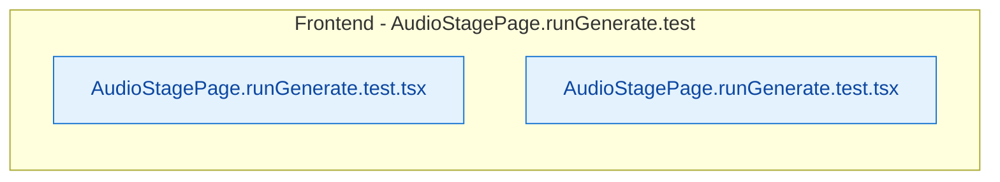

# Vertical Slice: AudioStagePage.runGenerate.test

**Files**: deploy/new_html/__tests__/pages/AudioStagePage.runGenerate.test.tsx, new_html/__tests__/pages/AudioStagePage.runGenerate.test.tsx

**Tables**: -

