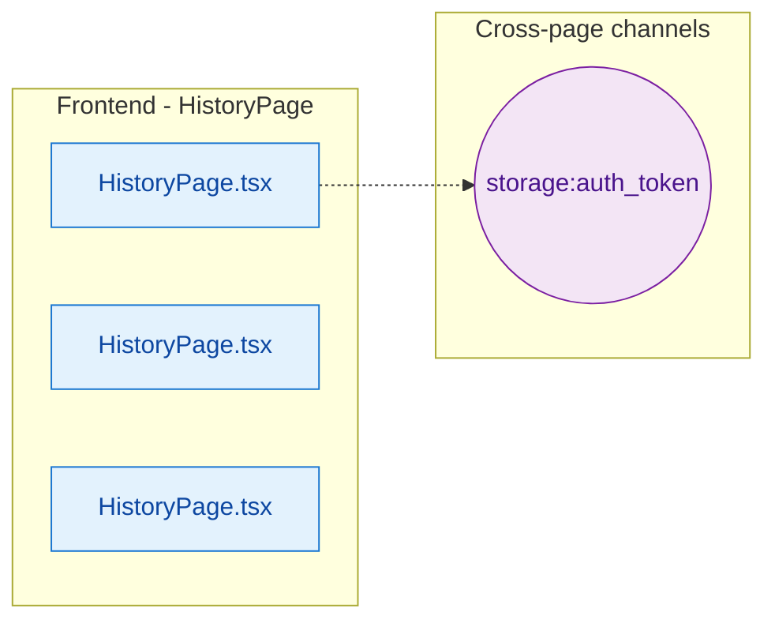

# Vertical Slice: HistoryPage

**Files**: deploy/new_html/components/HistoryPage.tsx, deploy/new_html/pages/HistoryPage.tsx, new_html/components/HistoryPage.tsx, new_html/pages/HistoryPage.tsx

**Tables**: -

