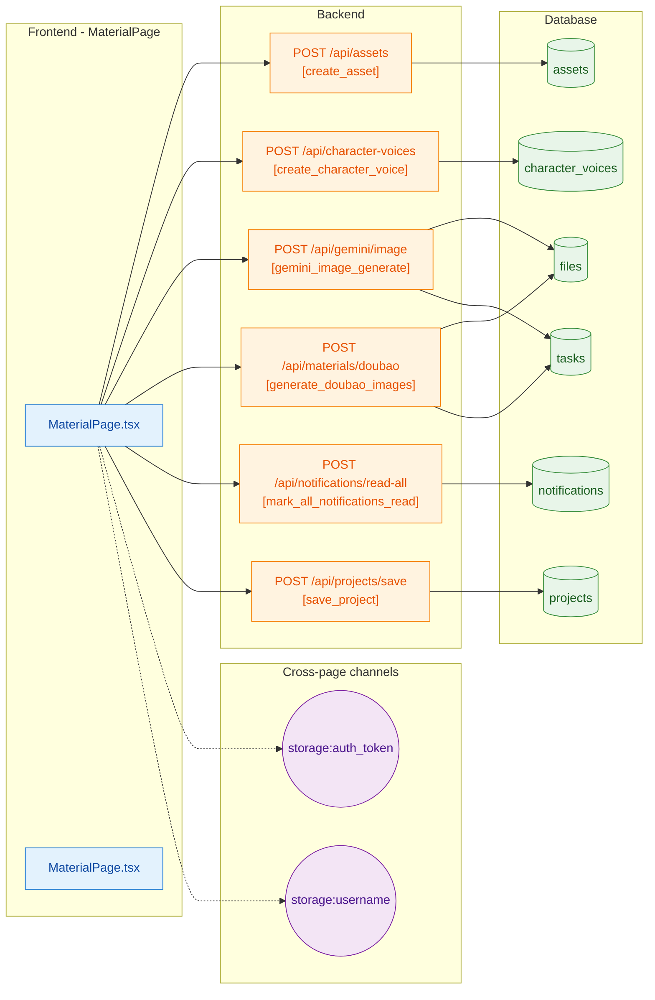

# Vertical Slice: MaterialPage

**Files**: deploy/new_html/components/MaterialPage.tsx, new_html/components/MaterialPage.tsx

**Tables**: assets, character_voices, files, notifications, projects, tasks

