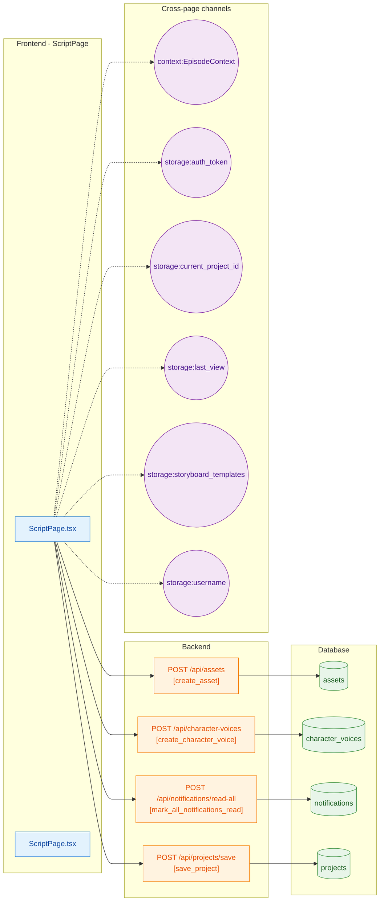
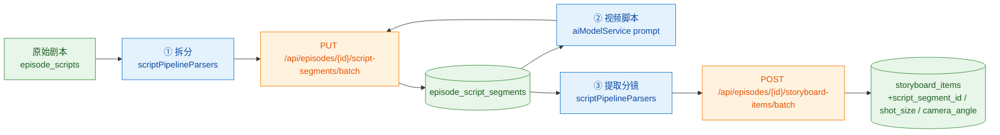

# Vertical Slice: ScriptPage

**Files**: deploy/new_html/pages/ScriptPage.tsx, new_html/pages/ScriptPage.tsx

**Tables**: assets, character_voices, notifications, projects

## 三步生成流程（2026-05-29）

ScriptPage / WorkspaceApp 的「三步生成面板」：拆分 → 视频脚本 → 提取分镜。

