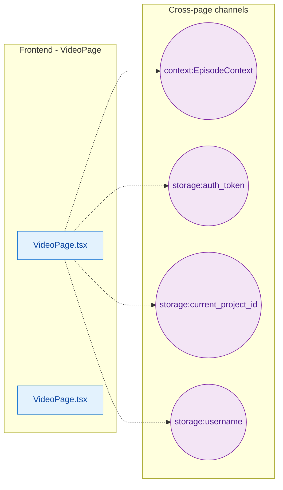

# Vertical Slice: VideoPage

**Files**: deploy/new_html/components/VideoPage.tsx, new_html/components/VideoPage.tsx

**Tables**: -

```mermaid
flowchart LR
  classDef fe fill:#e3f2fd,stroke:#1976d2,color:#0d47a1;
  classDef be fill:#fff3e0,stroke:#f57c00,color:#e65100;
  classDef db fill:#e8f5e9,stroke:#388e3c,color:#1b5e20;
  classDef ch fill:#f3e5f5,stroke:#7b1fa2,color:#4a148c;

  subgraph FE["Frontend - VideoPage"]
    fe_deploy_new_html_components_VideoPage_tsx["VideoPage.tsx"]:::fe
    fe_new_html_components_VideoPage_tsx["VideoPage.tsx"]:::fe
  end


  subgraph CH["Cross-page channels"]
    ch_context_EpisodeContext(("context:EpisodeContext")):::ch
    ch_storage_auth_token(("storage:auth_token")):::ch
    ch_storage_current_project_id(("storage:current_project_id")):::ch
    ch_storage_username(("storage:username")):::ch
  end
  fe_deploy_new_html_components_VideoPage_tsx -.-> ch_context_EpisodeContext
  fe_deploy_new_html_components_VideoPage_tsx -.-> ch_storage_auth_token
  fe_deploy_new_html_components_VideoPage_tsx -.-> ch_storage_current_project_id
  fe_deploy_new_html_components_VideoPage_tsx -.-> ch_storage_username
```
