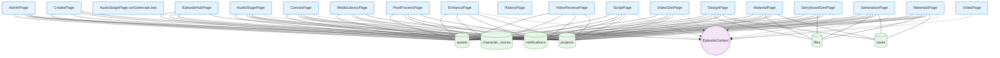

# System Overview

Pages connected by shared tables and React Contexts. Auto-generated.

```mermaid
flowchart TD
  classDef pg fill:#e3f2fd,stroke:#1976d2;
  classDef tb fill:#e8f5e9,stroke:#388e3c;
  classDef ch fill:#f3e5f5,stroke:#7b1fa2;

  p_AdminPage["AdminPage"]:::pg
  p_AudioStagePage["AudioStagePage"]:::pg
  p_AudioStagePage_runGenerate_test["AudioStagePage.runGenerate.test"]:::pg
  p_CanvasPage["CanvasPage"]:::pg
  p_CreditsPage["CreditsPage"]:::pg
  p_DesignPage["DesignPage"]:::pg
  p_EnhancePage["EnhancePage"]:::pg
  p_EpisodeHubPage["EpisodeHubPage"]:::pg
  p_GenerationPage["GenerationPage"]:::pg
  p_HistoryPage["HistoryPage"]:::pg
  p_MaterialPage["MaterialPage"]:::pg
  p_MaterialsPage["MaterialsPage"]:::pg
  p_MediaLibraryPage["MediaLibraryPage"]:::pg
  p_PostProcessPage["PostProcessPage"]:::pg
  p_ScriptPage["ScriptPage"]:::pg
  p_StoryboardGenPage["StoryboardGenPage"]:::pg
  p_VideoGenPage["VideoGenPage"]:::pg
  p_VideoPage["VideoPage"]:::pg
  p_VideoReversePage["VideoReversePage"]:::pg

  t_assets[("assets")]:::tb
  t_character_voices[("character_voices")]:::tb
  t_files[("files")]:::tb
  t_notifications[("notifications")]:::tb
  t_projects[("projects")]:::tb
  t_tasks[("tasks")]:::tb

  p_AdminPage --- t_assets
  p_AudioStagePage --- t_assets
  p_CanvasPage --- t_assets
  p_CreditsPage --- t_assets
  p_DesignPage --- t_assets
  p_EnhancePage --- t_assets
  p_EpisodeHubPage --- t_assets
  p_GenerationPage --- t_assets
  p_MaterialPage --- t_assets
  p_MaterialsPage --- t_assets
  p_MediaLibraryPage --- t_assets
  p_PostProcessPage --- t_assets
  p_ScriptPage --- t_assets
  p_StoryboardGenPage --- t_assets
  p_VideoGenPage --- t_assets
  p_VideoReversePage --- t_assets
  p_AdminPage --- t_character_voices
  p_AudioStagePage --- t_character_voices
  p_CanvasPage --- t_character_voices
  p_CreditsPage --- t_character_voices
  p_DesignPage --- t_character_voices
  p_EnhancePage --- t_character_voices
  p_EpisodeHubPage --- t_character_voices
  p_GenerationPage --- t_character_voices
  p_MaterialPage --- t_character_voices
  p_MaterialsPage --- t_character_voices
  p_MediaLibraryPage --- t_character_voices
  p_PostProcessPage --- t_character_voices
  p_ScriptPage --- t_character_voices
  p_StoryboardGenPage --- t_character_voices
  p_VideoGenPage --- t_character_voices
  p_VideoReversePage --- t_character_voices
  p_DesignPage --- t_files
  p_GenerationPage --- t_files
  p_MaterialPage --- t_files
  p_MaterialsPage --- t_files
  p_StoryboardGenPage --- t_files
  p_AdminPage --- t_notifications
  p_AudioStagePage --- t_notifications
  p_CanvasPage --- t_notifications
  p_CreditsPage --- t_notifications
  p_DesignPage --- t_notifications
  p_EnhancePage --- t_notifications
  p_EpisodeHubPage --- t_notifications
  p_GenerationPage --- t_notifications
  p_MaterialPage --- t_notifications
  p_MaterialsPage --- t_notifications
  p_MediaLibraryPage --- t_notifications
  p_PostProcessPage --- t_notifications
  p_ScriptPage --- t_notifications
  p_StoryboardGenPage --- t_notifications
  p_VideoGenPage --- t_notifications
  p_VideoReversePage --- t_notifications
  p_AdminPage --- t_projects
  p_AudioStagePage --- t_projects
  p_CanvasPage --- t_projects
  p_CreditsPage --- t_projects
  p_DesignPage --- t_projects
  p_EnhancePage --- t_projects
  p_EpisodeHubPage --- t_projects
  p_GenerationPage --- t_projects
  p_MaterialPage --- t_projects
  p_MaterialsPage --- t_projects
  p_MediaLibraryPage --- t_projects
  p_PostProcessPage --- t_projects
  p_ScriptPage --- t_projects
  p_StoryboardGenPage --- t_projects
  p_VideoGenPage --- t_projects
  p_VideoReversePage --- t_projects
  p_DesignPage --- t_tasks
  p_GenerationPage --- t_tasks
  p_MaterialPage --- t_tasks
  p_MaterialsPage --- t_tasks

  c_context_EpisodeContext(("EpisodeContext")):::ch
  p_AudioStagePage -.-> c_context_EpisodeContext
  p_CanvasPage -.-> c_context_EpisodeContext
  p_DesignPage -.-> c_context_EpisodeContext
  p_EnhancePage -.-> c_context_EpisodeContext
  p_GenerationPage -.-> c_context_EpisodeContext
  p_MaterialsPage -.-> c_context_EpisodeContext
  p_ScriptPage -.-> c_context_EpisodeContext
  p_StoryboardGenPage -.-> c_context_EpisodeContext
  p_VideoGenPage -.-> c_context_EpisodeContext
  p_VideoPage -.-> c_context_EpisodeContext
```
