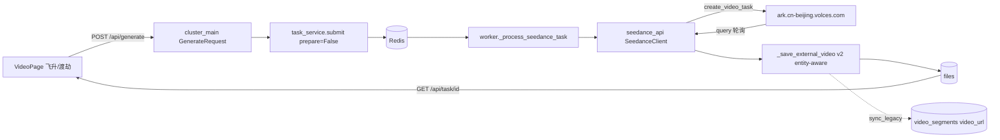

# Seedance 2.0 视频生成集成 — Design Spec

> Spec date: 2026-05-10 · Owner: video-gen team · Plan: docs/superpowers/plans/2026-05-10-seedance-2-integration.md

## 1. Background

MY2 是中文短视频/动画生成平台，前端在 `new_html/`（React + TypeScript + Vite），后端在仓库根目录（FastAPI + asyncpg + Redis）。当前已经接入了 4 家外部视频生成 API：

- **MiniMax**（中文别名「MINI 顶礼」）
- **Sora2**
- **Veo**
- **Wan2.6**（中文别名「大能」）

为了便于业务侧记忆，模型按"修仙阶序"命名：一阶 ~ 七阶 对应 ComfyUI 工作流，外部 API 模型则使用别名（MINI 顶礼 / Sora2 / Veo / 大能）。

本次目标是**新增火山方舟 Seedance 2.0 视频生成 API**，端点为：

```
POST https://ark.cn-beijing.volces.com/api/v3/contents/generations/tasks
```

子型号有两个：

- `doubao-seedance-2-0-260128`（标准版）
- `doubao-seedance-2-0-fast-260128`（快速版）

按用户钦定的命名约定：

- 标准版别名 = **「飞升」**（顶点境界，仅次于"渡劫"前一阶段）
- 快速版别名 = **「渡劫」**（次于飞升，但用户钦定让 fast 叫"渡劫"以体现迅捷感）

## 2. API 概览

### 2.1 五种生成场景

任务类型命名约定：`seedance_<scenario>`，共 5 种：

| task_type | 含义 | 输入要求 |
|---|---|---|
| `seedance_t2v` | 纯文生视频 | 仅 prompt |
| `seedance_i2v` | 单图生视频 | 1 张图（不带 role）+ prompt |
| `seedance_morph` | 首尾帧转场 | 2 张图，分别带 `role=first_frame` 和 `role=last_frame` |
| `seedance_multi` | 多模态参考 | ≤9 张图（`role=reference_image`）+ ≤3 视频（`role=reference_video`）+ ≤3 音频（`role=reference_audio`）|
| `seedance_draft` | 草稿复用 | 复用 1.5pro 样片任务 ID（**2.0 不支持，UI 灰显，代码路径预留**）|

### 2.2 contents 数组结构

请求体核心字段示例：

```json
{
  "model": "doubao-seedance-2-0-260128",
  "content": [
    {"type": "text", "text": "提示词"},
    {"type": "image_url", "image_url": {"url": "https://..."}, "role": "first_frame"},
    {"type": "video_url", "video_url": {"url": "https://..."}, "role": "reference_video"},
    {"type": "audio_url", "audio_url": {"url": "https://..."}, "role": "reference_audio"}
  ],
  "resolution": "720p",
  "ratio": "16:9",
  "duration": 5,
  "seed": -1,
  "watermark": false,
  "generate_audio": true,
  "camera_fixed": false
}
```

### 2.3 七个可调参数

| 参数 | 取值 | 说明 |
|---|---|---|
| `resolution` | `480p` / `720p` / `1080p` | fast 子型号**不支持** 1080p |
| `ratio` | `adaptive` / `16:9` / `4:3` / `1:1` / `3:4` / `9:16` / `21:9` | 画面比例 |
| `duration` | 4–15 秒，或 `-1` | `-1` = 智能选择 |
| `seed` | 整数，`-1` = 随机 | 随机种子 |
| `watermark` | bool | 是否打水印 |
| `generate_audio` | bool | 是否启用 AI 配音 |
| `camera_fixed` | bool | **仅 1.5pro 支持，2.0 系列无效**；代码透传以前向兼容 |

## 3. 决策记录

| 维度 | 决策 |
|---|---|
| 支持场景 | 全 5 种（t2v / i2v / morph / multi / draft）；draft 在 2.0 上 UI 灰显，但代码路径预留 |
| 子型号 | 下拉两条选项：**Seedance2** / **Seedance2Fast** |
| 中文别名 | **「飞升」**（标准）/ **「渡劫」**（fast）|
| API Key | 新 provider=`seedance` + `ARK_API_KEY` 兜底（env：`SEEDANCE_API_KEY` 优先；缺省回落 `ARK_API_KEY`，跟 `veo_api` 同模式）|
| `video_segments` 漏洞 | **同提交修复**——5 家外部 API 全部改走 entity-aware 落库路径 |
| 参数面板 | 全量 7 参数 + "高级设置"折叠面板 |

## 4. 架构数据流



数据流核心要点：

1. 前端 `VideoPage` 选择「飞升」或「渡劫」后，POST 到 `/api/generate`，body 携带 `task_type=seedance_*`、`sub_model=standard|fast`、`media_inputs=[...]` 及 7 个参数。
2. `cluster_main` 解析 `GenerateRequest`，转交 `task_service.submit(prepare=False)` 入队 Redis。
3. Worker 从 Redis 拉到任务后调用 `_process_seedance_task`，进入 `seedance_api.SeedanceClient`。
4. Client 调 ARK 端点 `create_video_task`，随后轮询查询任务状态。
5. 完成后调用 v2 entity-aware 版的 `_save_external_video`：主写 `files` 表；并通过 `sync_legacy` 同步到 `video_segments.video_url`，修复历史漏洞。
6. 前端通过 `GET /api/task/{id}` 拉到任务状态与产物 URL。

## 5. 数据合同

### 5.1 前端 SeedanceMediaInput（TypeScript）

```typescript
interface SeedanceMediaInput {
    kind: 'image' | 'video' | 'audio';
    url: string;          // 持久化 URL（已上传）
    role?: 'first_frame' | 'last_frame' | 'reference_image' | 'reference_video' | 'reference_audio';
    file_id?: string;
}
```

### 5.2 后端 GenerateRequest 新增字段（Pydantic）

| 字段 | 类型 | 默认 | 说明 |
|---|---|---|---|
| `sub_model` | `Optional[str]` | `None` | `'standard'` \| `'fast'` |
| `media_inputs` | `Optional[List[Dict]]` | `None` | SD2.0 多模态输入数组（结构同前端 `SeedanceMediaInput`）|
| `ratio` | `Optional[str]` | `"adaptive"` | 画面比例 |
| `watermark` | `Optional[bool]` | `False` | 是否打水印 |
| `generate_audio` | `Optional[bool]` | `True` | 是否启用 AI 配音 |
| `camera_fixed` | `Optional[bool]` | `False` | 仅 1.5pro 生效 |

> `resolution` / `duration` / `seed` / `shot_type` 复用 `GenerateRequest` 现有字段，不重复声明。

## 6. 边界与互斥规则

- 首尾帧（`first_frame` + `last_frame`）与 `reference_image` **不能共存**。
- 首帧 / 尾帧必须**成对出现**——不能只给其中一个。
- 一次请求**至少需要 1 个媒体输入**或**非空 prompt**。
- fast 子型号不支持 `1080p`：前端禁用该选项，后端兜底降级到 `720p`。
- `camera_fixed` 在 2.0 系列 API 上无效：前端灰显并标注「仅 1.5pro」，后端透传以保持前向兼容。
- 真人脸图最多 **3 张**（API 硬限）。
- 单次请求 contents 总大小 **≤ 64 MB**。
- 视频参考最多 **3 段**，且总时长 **≤ 15s**。
- 音频参考最多 **3 段**，且总时长 **≤ 15s**。

## 7. 验收标准

- [ ] 「飞升」/「渡劫」下拉可见，5 种场景（t2v / i2v / morph / multi / draft）均可提交。
- [ ] 任务完成后 `video_segments.video_url` 自动有值（**不再依赖前端 CRUD**）。
- [ ] `SEEDANCE_API_KEY` 缺失时自动回落 `ARK_API_KEY` 跑通完整链路。
- [ ] 旧 4 家任务（sora2 / veo / minimax / wan26）的 `_save_external_video` 改造后回归通过。
- [ ] 7 参数 UI 联动正确：fast × 1080p 禁用、`camera_fixed` 在 2.0 下灰显。
- [ ] `python .claude/skills/project-memory/scripts/sync_check.py` 无 drift。
- [ ] `gitnexus_detect_changes()` 报告的影响范围与本 spec 描述一致。
