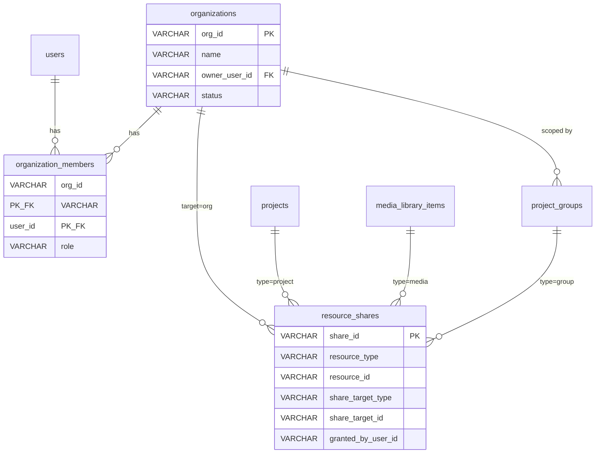

# 组织管理 MVP — Design Spec

**Date**: 2026-05-26
**Status**: Approved — 进入实施
**Plan file**: `.cursor/plans/org_management_mvp_aa4a67de.plan.md`
**Related**:
- 现有 Slice 4 plan：`docs/superpowers/plans/2026-05-26-feature-rollout/04-admin-users-project-groups.md`（已落地 `project_groups` + `projects.visibility` + `users.role`）
- 本 spec 是 Slice 4 的 Stage-2 延伸：从「个人分组」升级到「多人组织协作」

---

## 1. Goal

把当前「单 owner 的 `project_groups`」升级为「多人组织（Organization）+ 资源可共享」的协作模型。

**User-visible result**:

- **System admin**：在 `/admin/operations → 组织管理` tab 新建组织、指定 owner、增删成员、改成员 role
- **普通用户**：顶栏新增 Workspace Switcher（个人 / 我加入的组织），切到组织后看到「该组织里可见」的项目和素材
- **资源创建者**：上传素材 / 新建项目时勾「对组可见」，自动共享给当前 workspace 所在组织；也可在资源详情面板点「共享」按钮显式共享到任意可见目标

**对老用户的影响**：零。未加入任何组织的用户只看到自己的资源（旧行为），所有老资源 `visibility='private'` 不暴露给任何人。

---

## 2. Decision Log

以下决策来自 2026-05-26 brainstorming session（见 chat transcript）：

| # | 维度 | 选择 | 备注 |
|---|------|------|------|
| 1 | 组织层级 | **一级实体**（新建 organizations 表） | 不复用 project_groups |
| 2 | 空间模式 | **GitHub 风格** — 个人空间 + 多组织并存 | 用户可同时属于多个组织 |
| 3 | 角色 | **owner / admin / member 三级** | owner 唯一，可后续转让 |
| 4 | 创建权限 | **仅 system admin（`require_admin`）** | B2B 部署语义，普通用户不能自建组织 |
| 5 | 共享粒度 | 资源可共享到「组织」或「组织内某个具体项目」 | 同一资源可同时共享给多个目标 |
| 6 | 默认可见性 | **资源级 `visibility` 字段** + shares 表 | 选「对组可见」时自动 share 给当前 workspace 组织 |

**默认假设（用户未明确表态，spec 锁定此值）**：

| # | 维度 | 默认 | 可后续改 |
|---|------|------|---------|
| 7 | 邀请方式 | **direct_add**（admin 拉人立即生效）| 后续可加 invite/accept 流程 |
| 8 | 离开组织资源 | **stay_visible**（owner_user_id 不变，资源仍在组织里给其他成员看）| 后续可加退组弹窗让用户选 |
| 9 | 多组织用户的"主组织" | **不持久化**（靠 workspace switcher 即时切换）| 后续可加 default_org_id 列 |

---

## 3. Existing System Relationships

| 层 | 现有 | 复用 / 扩展 / 新增 |
|----|------|---------------------|
| Database | `users.role` ('user'/'admin'/'super_admin')、`projects.visibility VARCHAR(30) DEFAULT 'private'`、`projects.group_id` → `project_groups.group_id`、`project_groups.team_id`（**未使用**的预留列）、`media_library_items`（无 visibility）| 新增 3 表 + 给 `media_library_items` 加 visibility + 给 `project_groups` 加 `organization_id` |
| Backend | `admin_routes.py`（已有 `require_admin` 闸门 + project_groups 端点） | 扩展加组织 CRUD + 成员 + 共享端点 |
| DAO | `dao_user.py`（已有 set_role/set_status）、`dao_project_group.py`（已有 CRUD）| 新增 `dao_organization.py` + `dao_resource_share.py` |
| Frontend | AdminPage（已有用户管理 / 项目分组 tab）、Header（已有用户菜单）| AdminPage 加「组织管理」tab、Header 加 WorkspaceSwitcher |
| Auth | `admin/adminAuth.ts`（已有 sessionStorage admin token 隔离） | 不变 — 组织成员关系不影响系统级 admin token |

---

## 4. Data Model

### 4.1 新表（3 张）

```sql
-- ============================================
-- db_migration_organizations.sql
-- 2026-05-26 Organization Management MVP
-- ============================================

-- 组织
CREATE TABLE IF NOT EXISTS organizations (
    id            SERIAL PRIMARY KEY,
    org_id        VARCHAR(50) UNIQUE NOT NULL,     -- 业务 id，形如 'org_xxxxxxxx'
    name          VARCHAR(100) NOT NULL,
    description   TEXT DEFAULT '',
    owner_user_id VARCHAR(50) NOT NULL REFERENCES users(user_id),
    status        VARCHAR(20) NOT NULL DEFAULT 'active',  -- active | archived
    color         VARCHAR(20),                     -- 可选 UI 用色
    created_at    TIMESTAMP DEFAULT CURRENT_TIMESTAMP,
    updated_at    TIMESTAMP DEFAULT CURRENT_TIMESTAMP,
    created_by    VARCHAR(50)                       -- 创建该组织的 admin
);
CREATE INDEX IF NOT EXISTS idx_organizations_owner  ON organizations(owner_user_id);
CREATE INDEX IF NOT EXISTS idx_organizations_status ON organizations(status);

-- 组织成员（M:N）
CREATE TABLE IF NOT EXISTS organization_members (
    org_id    VARCHAR(50) NOT NULL REFERENCES organizations(org_id) ON DELETE CASCADE,
    user_id   VARCHAR(50) NOT NULL REFERENCES users(user_id) ON DELETE CASCADE,
    role      VARCHAR(20) NOT NULL DEFAULT 'member',  -- owner | admin | member
    joined_at TIMESTAMP DEFAULT CURRENT_TIMESTAMP,
    added_by  VARCHAR(50),
    PRIMARY KEY (org_id, user_id)
);
CREATE INDEX IF NOT EXISTS idx_org_members_user ON organization_members(user_id);
CREATE INDEX IF NOT EXISTS idx_org_members_role ON organization_members(role);

-- 资源共享（多态 M:N 映射）
CREATE TABLE IF NOT EXISTS resource_shares (
    id                  SERIAL PRIMARY KEY,
    share_id            VARCHAR(50) UNIQUE NOT NULL,  -- 业务 id 'shr_xxx'
    resource_type       VARCHAR(20) NOT NULL,  -- 'project' | 'media' | 'group'
    resource_id         VARCHAR(50) NOT NULL,  -- projects.project_id / media_library_items.media_id / project_groups.group_id
    share_target_type   VARCHAR(20) NOT NULL,  -- 'org' | 'project'
    share_target_id     VARCHAR(50) NOT NULL,  -- organizations.org_id 或 projects.project_id
    granted_by_user_id  VARCHAR(50) NOT NULL REFERENCES users(user_id),
    granted_at          TIMESTAMP DEFAULT CURRENT_TIMESTAMP,
    UNIQUE (resource_type, resource_id, share_target_type, share_target_id)
);
CREATE INDEX IF NOT EXISTS idx_shares_resource ON resource_shares(resource_type, resource_id);
CREATE INDEX IF NOT EXISTS idx_shares_target   ON resource_shares(share_target_type, share_target_id);

-- 自动维护 updated_at
CREATE OR REPLACE FUNCTION update_organizations_updated_at()
RETURNS TRIGGER AS $$
BEGIN
    NEW.updated_at = CURRENT_TIMESTAMP;
    RETURN NEW;
END;
$$ LANGUAGE plpgsql;

DROP TRIGGER IF EXISTS trg_organizations_updated_at ON organizations;
CREATE TRIGGER trg_organizations_updated_at
    BEFORE UPDATE ON organizations
    FOR EACH ROW EXECUTE FUNCTION update_organizations_updated_at();
```

### 4.2 扩展现有表

```sql
-- ============================================
-- db_migration_visibility_columns.sql
-- ============================================

-- media_library_items 加 visibility（projects 已有，不重复）
ALTER TABLE media_library_items ADD COLUMN IF NOT EXISTS visibility VARCHAR(30) DEFAULT 'private';
CREATE INDEX IF NOT EXISTS idx_media_visibility ON media_library_items(visibility);

-- project_groups 加 organization_id（之前的 team_id 列保留 backward-compat，不再使用）
ALTER TABLE project_groups ADD COLUMN IF NOT EXISTS organization_id VARCHAR(50)
    REFERENCES organizations(org_id) ON DELETE SET NULL;
CREATE INDEX IF NOT EXISTS idx_project_groups_org ON project_groups(organization_id);

-- 注：projects.visibility 在 2026-05-26 Slice 4 已加（VARCHAR(30) DEFAULT 'private'），本 spec 不重复 ALTER
-- 注：project_groups.team_id 是历史预留列（Stage-2 没用上），本 spec 改用 organization_id（语义更清晰）
```

### 4.3 关系图



### 4.4 visibility 字段语义（关键！）

| visibility 值 | 含义 | 是否参与权限查询？ |
|---------------|------|---------------------|
| `private` | 仅 owner 可见 | **是**（默认值）|
| `org-default` | 创建时如果当前 workspace=某组织 X，**自动**往 resource_shares 插一行 (target=org:X) | **否** — UI 用作 badge 显示 |

**真正的权限判断逻辑全部走 `resource_shares` 表，不读 `visibility` 列**。visibility 列只在创建对话框 UI 上用来快捷生成 share 记录，以及在资源卡片显示 badge。

---

## 5. API Contracts

### 5.1 Admin 组织管理（全部 `Depends(require_admin)`）

| Method | Path | Body / Query | Response |
|--------|------|--------------|----------|
| GET | `/api/admin/organizations` | `?status=&keyword=&limit=&offset=` | `{ success, organizations: [...], total }` |
| POST | `/api/admin/organizations` | `{ name, description?, owner_user_id, color? }` | `{ success, organization: {...} }` |
| GET | `/api/admin/organizations/{org_id}` | — | `{ success, organization: {...}, members: [...] }` |
| PUT | `/api/admin/organizations/{org_id}` | `{ name?, description?, status?, color? }` | `{ success, organization }` |
| DELETE | `/api/admin/organizations/{org_id}` | — | `{ success }` — CASCADE 删 members + shares |
| GET | `/api/admin/organizations/{org_id}/members` | — | `{ success, members: [{user_id, username, role, joined_at}] }` |
| POST | `/api/admin/organizations/{org_id}/members` | `{ user_id, role? }` | `{ success, member }` |
| DELETE | `/api/admin/organizations/{org_id}/members/{user_id}` | — | `{ success }` |
| PUT | `/api/admin/organizations/{org_id}/members/{user_id}/role` | `{ role: 'owner'\|'admin'\|'member' }` | `{ success }` |

### 5.2 用户自服务

| Method | Path | 用途 |
|--------|------|------|
| GET | `/api/me/organizations` | 我加入的组织列表（用作 WorkspaceSwitcher 数据源）|
| POST | `/api/me/organizations/{org_id}/leave` | 主动退出（owner 不能退）|

### 5.3 资源共享（用户对自己 owner 的资源；admin 不限）

| Method | Path | Body / Query | Response |
|--------|------|--------------|----------|
| GET | `/api/shares` | `?resource_type=&resource_id=` | `{ success, shares: [...] }` |
| POST | `/api/shares` | `{ resource_type, resource_id, share_target_type, share_target_id }` | `{ success, share }` |
| DELETE | `/api/shares/{share_id}` | — | `{ success }` |

### 5.4 现有 list API 改造（向后兼容）

| Path | 旧行为 | 新增 query param | 新行为 |
|------|--------|-----------------|--------|
| `GET /api/projects` | `WHERE user_id = me` | `?org_id=X` | `WHERE me IN org X.members AND (owner=me OR id IN shares to org:X OR group_id IN shares to org:X)` |
| `GET /api/media-library` | `WHERE user_id = me` | `?org_id=X` | 同上模式 |
| `GET /api/admin/project-groups` | 列全部 / 按 user_id 过滤 | `?org_id=X` | 加 `AND organization_id = X` 过滤 |

**不传 `org_id` = 完全旧行为**（个人空间）；老前端页面 0 改动可用。

---

## 6. Frontend Changes

### 6.1 Admin 端（`/admin/operations`）

`new_html/admin/AdminOrganizationsTab.tsx`（新）：

- 列表行：组织名 / owner / 成员数 / 创建时间 / 状态 badge / 操作（删除）
- 列表顶部：搜索 + 状态过滤 + 「+ 创建组织」按钮
- 行展开（drawer）：成员表（用户名 / role / 加入时间 / 操作）+「+ 添加成员」（用户下拉 + role 下拉）

接入位置：在 `new_html/components/AdminFeatureTabs.tsx` 的 tab 列表里加 "组织管理" tab（插在「项目分组」旁边）。

### 6.2 主站端

#### WorkspaceSwitcher（`new_html/components/WorkspaceSwitcher.tsx`，新）

放在 `new_html/components/Header.tsx` 用户菜单左侧：

- 显示当前 workspace 名 + 下拉箭头
- 下拉：
  - "个人空间" (radio 选中)
  - 我加入的组织列表（从 `GET /api/me/organizations` 拿）
- 选中后写 `sessionStorage.current_workspace`（值：`'personal'` 或 `org_id`）
- 触发 `WorkspaceContext` 状态更新 → ProjectHub / MediaLibraryPage 重新拉数据

#### WorkspaceContext（`new_html/contexts/WorkspaceContext.tsx`，新）

```ts
interface WorkspaceContext {
  currentWorkspace: 'personal' | string;   // 'personal' 或 org_id
  organizations: Organization[];           // 我加入的组织列表
  setWorkspace(ws: 'personal' | string): void;
  refreshOrganizations(): Promise<void>;
}
```

- mount 时调 `GET /api/me/organizations` 拉组织列表
- 从 `sessionStorage.current_workspace` 还原状态（默认 'personal'）
- 状态写回 sessionStorage（tab 级隔离）

### 6.3 ShareResourceDialog（`new_html/components/ShareResourceDialog.tsx`，新）

接受 props `{ resource_type, resource_id, resource_name }`：

- 顶部：已共享目标列表（每行有"取消共享"按钮，调 DELETE）
- 中部：新增共享表单
  - 目标类型 radio: 「整个组织」/「组织内某项目」
  - 目标选择：先选组织（dropdown，来源 `GET /api/me/organizations`），如果是 project 模式则再选该组织内的项目
- 底部："共享" 按钮（调 POST），"关闭" 按钮

接入：在 `SeedanceDetailModal` / `MediaLibraryPage` 的 item action 上加"共享"按钮触发本对话框。

### 6.4 创建对话框 visibility 开关

- ProjectHub 「+ 新建项目」对话框：加 visibility radio（`private` / `org-default`）
- MaterialsPage / GenerationPage / VideoGenPage 等上传素材入口：加同样 radio
- 行为：
  - `private` 默认
  - `org-default` + 当前 workspace ≠ 'personal' → 创建成功后**自动** POST /api/shares 把资源 share 给当前 org
  - `org-default` + workspace='personal' → 提示「请先切到组织 workspace 或手动选择共享目标」（不自动 share）

### 6.5 资源卡 visibility badge

ProjectHub / MediaLibraryPage 的卡片 / 列表项加小角标：

- 🔒 私有 / 🌐 对组可见
- 鼠标悬停显示"共享给：组织 A, 组织 B 内项目 X"

---

## 7. Implementation Slices

按依赖排序，每个 slice 独立可部署 + 通过 project-memory 闭环（impact_check → 编码 → scan → sync_check → 文档）。

### Slice 0 — Spec（本文件）

- DOD: spec 写完 + spec self-review pass + commit

### Slice 1 — DB schema + DAO

**文件**：
- `db_migration_organizations.sql`（新）+ `deploy/` 镜像 + `deploy/sql/` 镜像
- `db_migration_visibility_columns.sql`（新，仅 media_library_items.visibility + project_groups.organization_id）
- `dao_organization.py`（新）：
  - `OrganizationDAO`: create / get / list / update / delete
  - `OrganizationMemberDAO`: add_member / remove_member / list_members / set_role / list_orgs_for_user / is_member / get_role
- `dao_resource_share.py`（新）：
  - create_share / delete_share / list_for_resource / list_for_target / is_resource_shared_with_org

**DOD**：
- 新表能在 dev DB 创建
- DAO 单测在 `tests/test_dao_organization.py` 和 `tests/test_dao_resource_share.py` 全过
- 跑 schema-change workflow（project-memory §5）

### Slice 2 — Admin API + UI

**文件**：
- `admin_routes.py` 加 9 个端点（5.1 + 5.2 节）
- `new_html/services/organizationService.ts`（新）
- `new_html/admin/AdminOrganizationsTab.tsx`（新）
- `new_html/components/AdminFeatureTabs.tsx` 加 tab 入口

**DOD**：admin 能在 UI 上跑完整流程 — 建组织 → 拉 2 人 → 改 role → 删人。

### Slice 3 — WorkspaceContext + 主站 list 改造（**高风险**）

**文件**：
- `new_html/contexts/WorkspaceContext.tsx`（新）
- `new_html/components/WorkspaceSwitcher.tsx`（新）
- `new_html/components/Header.tsx`（接入）
- `cluster_main.py`：`GET /api/projects` 加 `?org_id=` + 共享 JOIN
- `media_library_routes.py` 或 `cluster_main.py`：`GET /api/media-library` 同
- `admin_routes.py`：`GET /api/admin/project-groups` 加 `?org_id=`
- `new_html/services/apiService.ts`：list 调用接受可选 org_id

**关键风险点**：18 个前端页面调 `/api/projects` 或 `/api/media-library`。**缓解**：完全向后兼容（不传 org_id = 旧行为），且通过 WorkspaceContext 的 default = 'personal' 默认不传。手动 e2e 跑一遍所有用到这两个 API 的页面。

**DOD**：
- WorkspaceSwitcher 切到组织后 ProjectHub / MediaLibraryPage 显示该组织 visible 资源
- 切回个人空间显示个人资源
- 不在任何组织里的用户切换器只显示「个人空间」选项

### Slice 4 — 资源共享 UI

**文件**：
- `share_routes.py`（新）
- `cluster_main.py`：`from share_routes import router as share_router; app.include_router(share_router)`
- `new_html/services/shareService.ts`（新）
- `new_html/components/ShareResourceDialog.tsx`（新）
- `new_html/components/video/SeedanceDetailModal.tsx`、`MediaLibraryPage.tsx` 等加「共享」按钮

**DOD**：用户能在素材详情面板共享给组织或组织内项目；共享列表能查能删。

### Slice 5 — 创建对话框 visibility 开关

**文件**：
- ProjectHub "新建项目" 对话框：加 visibility radio + 创建成功后自动 share
- 上传素材所有入口（MaterialsPage / GenerationPage / VideoGenPage）：加 radio + 自动 share
- 资源卡组件加 visibility badge

**DOD**：用户在组织 workspace 下勾「对组可见」上传素材，组员立即在该组织 workspace 下能看到。

### Slice 6 — admin 统计按组分列

**文件**：
- `cluster_main.py`：`GET /api/admin/stats` 加 `?group_by=org_id` 维度
- `new_html/components/AdminPage.tsx`「生成统计分析」tab 加切换按钮

**DOD**：admin 能在统计页切换「按用户 / 按组织」聚合视图。

### 跨 slice — 文档同步

每个 slice 结束都跑：

```bash
python <project-memory>/scripts/scan_project.py h:/MY2
python <project-memory>/scripts/sync_check.py h:/MY2 --strict --levels ERROR
```

更新（按改动决定哪些）：
- `docs/database.md` — Slice 1 后
- `docs/api.md` — Slice 2/3/4/6 后
- `docs/vertical-slices.md` — 每个 slice 涉及的页面行
- `docs/frontend.md` — Slice 2/3/4 新组件
- `docs/faq.md` — 遇到坑就立刻沉淀

镜像 deploy/ + rebuild dist 在 Slice 2/3/4/5/6 后做。

---

## 8. Risks & Mitigations

| 风险 | 等级 | 缓解 |
|------|------|------|
| Slice 3 改 `/api/projects`、`/api/media-library` 是公共契约 | **高** | 参数化向后兼容；e2e 验证所有 18 个调用页 |
| 3 表 schema 改动（2 个 ALTER + 3 新表）需要 migration 窗口 | 中 | `IF NOT EXISTS` + DEFAULT 值，无 downtime；dev → staging → prod 阶梯 |
| resource_shares 表查询慢（每次 list 都要 JOIN） | 中 | (resource_type, resource_id) 和 (share_target_type, share_target_id) 复合索引；测大数据集性能 |
| 用户在多个组织时 workspace switcher UX 混乱 | 低 | sessionStorage tab 级隔离 + 顶栏始终显示当前 workspace 名 |
| visibility='org-default' 在 workspace=personal 时自动 share 没目标 | 低 | UI 端阻断 + 后端 spec 拒绝（visibility != private 但无任何 share record 时返回 400）|

---

## 9. Open Questions / Future Work

非本 MVP 范围，但 spec 中记下供后续 PR 处理：

1. **邀请-接受流程**：当前 admin 拉人即生效。如果用户希望"主动接受才能加入"，加 `invitations` 表 + `/api/me/invitations` 端点。
2. **组织级 credit / quota**：组织成员消耗的 credit 是否走组织池？目前仍是个人池。
3. **组织级审计日志**：当前 `admin_audit_logs` 是系统级。如果需要"组织 owner 看自己组里 admin 操作历史"，需新加 `org_audit_logs` 表或在 admin_audit_logs 加 organization_id 列。
4. **资源 transfer**：把个人资源**所有权**转给组织（不只是共享）。需要 owner_user_id 改成 owner_type='user'|'org' + owner_id 多态字段。
5. **细粒度 RBAC**：当前 member 在组织内对所有共享资源是"可见即可编辑"。后续可加资源级 viewer/editor 区分。
6. **跨组织共享**：当前 resource_shares 支持 target=org，但 UI 上只能从自己加入的组织里选。如果允许"我把素材 share 给我没加入的组织"，需要邀请流程或 token 机制。

---

## 10. Spec Self-Review

- [x] 占位符扫描：无 TBD / TODO / 空段落
- [x] 内部一致性：第 4 节 ER 图与第 4.1/4.2 SQL 字段名一致；第 5 节 API 与第 4 节字段一致
- [x] 范围检查：6 个 slice 都能独立部署，整套是一个完整可上线 MVP
- [x] 歧义检查：visibility 语义在 4.4 节明确（不参与权限查询，纯 UI 用）；当前 workspace 默认 'personal' 兜底；旧 API 不传 org_id 完全等同旧行为
